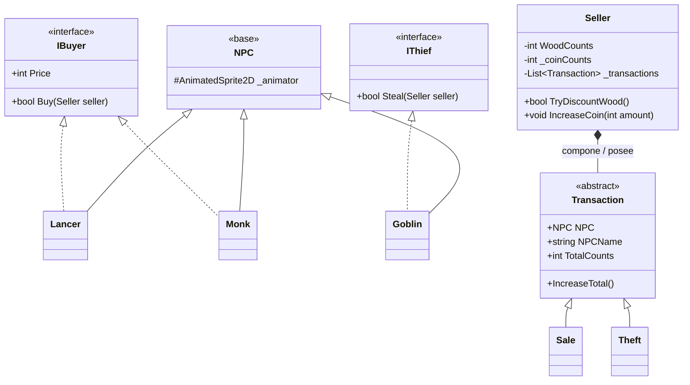

# Seller Game · Taller de POO

> Videojuego 2D desarrollado en **Godot 4** con **C#**. El proyecto aplica herencia, interfaces, encapsulamiento, composición y polimorfismo a las interacciones entre un vendedor y distintos NPC.

## Objetivo

El jugador controla a **Seller**, un vendedor que se acerca a NPC y presiona **X** para interactuar. Cada NPC expresa lo que puede hacer mediante interfaces: puede comprar madera o puede robarla. Además, Seller conserva un historial de las operaciones realizadas durante la partida.

## Controles

| Tecla | Acción |
| :---: | --- |
| Flechas | Mover a Seller |
| `X` | Interactuar con el NPC cercano |
| `Z` | Imprimir el historial de transacciones en la pestaña **Salida** de Godot |

## Diseño orientado a objetos



---

## Paso 3 · Monk como comprador

`Monk` hereda de `NPC` e implementa `IBuyer`:

```csharp
public partial class Monk : NPC, IBuyer
{
    [Export]
    private int _price = 10;

    public int Price => _price;
}
```

- La herencia evita repetir la configuración y comportamiento común de los NPC.
- `IBuyer` representa la capacidad de comprar, no la identidad concreta de un personaje.
- El precio es privado y se expone únicamente mediante `Price`; `[Export]` permite configurarlo desde el Inspector de Godot.
- Monk tiene un precio distinto de Lancer. Al realizar una venta válida consume una madera, suma su precio a las monedas y desaparece de la escena.
- `monk.tscn` fue instanciada en `world.tscn`, por lo que participa en el mundo como los demás NPC.

## Paso 4 · Goblin como ladrón

`Goblin` hereda de `NPC` e implementa `IThief`:

```csharp
public partial class Goblin : NPC, IThief
{
    public bool Steal(Seller seller)
    {
        return seller.TryDiscountWood();
    }
}
```

La operación `TryDiscountWood()` pertenece a Seller porque Seller es dueño de su inventario y de la actualización de su HUD. Devuelve un valor booleano:

- `true`: había madera, se descuenta una unidad y el HUD se actualiza.
- `false`: la madera ya estaba en cero; no se descuenta nada ni se produce un robo.

De esta forma el inventario nunca queda negativo y Goblin no accede ni modifica directamente los atributos internos de Seller.

## Paso 5 · Historial de transacciones

Se creó la clase abstracta `Transaction`, con los datos comunes de una operación:

| Atributo | Responsabilidad |
| --- | --- |
| `NPC` | Referencia al NPC que originó la transacción. |
| `NPCName` | Nombre capturado al crear el registro; permite mostrar a Monk incluso después de `QueueFree()`. |
| `TotalCounts` | Número acumulado de operaciones para ese NPC. |

Las clases `Sale` y `Theft` heredan de `Transaction`. Así, el tipo de operación se representa con polimorfismo, no con banderas, tags o comparaciones de texto para tomar decisiones de negocio.

Seller declara una lista privada:

```csharp
private readonly List<Transaction> _transactions = new();
```

Esto es **composición**: Seller crea, guarda y controla el ciclo de vida del historial. La lista no existe de forma independiente a Seller.

Cuando se presiona `X`, Seller identifica la capacidad del NPC mediante las interfaces:

```csharp
if (npc is IBuyer buyer)
{
    if (buyer.Buy(this))
    {
        RegisterSale(npc);
    }
}
```

Antes de registrar, Seller busca si ya existe una transacción del mismo objeto `NPC`. Si existe, incrementa `TotalCounts`; si no, crea una `Sale` o `Theft`. Por ello, vender dos veces al mismo Lancer produce un único registro acumulado:

```text
Lancer | Venta | Total: 2
Goblin | Robo | Total: 2
Monk | Venta | Total: 1
```

La tecla `Z` recorre la colección e imprime el historial en **Salida** de Godot.

## Decisiones de diseño

- **Sin tipos concretos en Seller:** no existe `is Lancer`, `is Monk` ni `is Goblin`. Seller pregunta por `IBuyer` o `IThief`.
- **Encapsulamiento:** madera, monedas y contador de transacciones no pueden modificarse directamente desde otras clases. Seller ofrece métodos controlados como `TryDiscountWood()` e `IncreaseCoin(int amount)`.
- **Resultado explícito:** `Buy()` y `Steal()` devuelven `bool`. Seller registra una transacción solo cuando la operación fue exitosa.
- **Sin números mágicos en Seller:** valores como la madera inicial y la velocidad se declaran como constantes con nombre.
- **Responsabilidades separadas:** `_Process()` delega las entradas de interacción e historial a métodos privados. La lógica de cada capacidad vive en su NPC o en Seller, según corresponda.

## Cómo ejecutar

1. Abrir el proyecto con Godot 4 instalado con soporte para C#/.NET.
2. Compilar la solución desde **Compilar → Compilar solución**.
3. Abrir `world.tscn` y ejecutar la escena con `F6`, o ejecutar el proyecto con `F5`.
4. Interactuar con los NPC y revisar el historial en la pestaña **Salida**.

## Pruebas manuales realizadas

- [x] Monk aparece en el mundo, compra madera y aplica un precio diferente al de Lancer.
- [x] Goblin descuenta madera y refleja el cambio en el HUD.
- [x] Goblin no puede robar cuando Seller tiene cero unidades de madera.
- [x] La venta y el robo crean o acumulan transacciones correctamente.
- [x] La tecla `Z` imprime el NPC, el tipo de transacción y el total acumulado.
